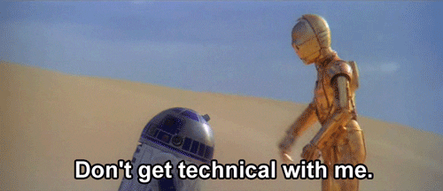

<h1 align="center">🤖 Hey, I'm Léo Chiche</h1>
<h3 align="center">Always eager for knowledge !</h3>

  

---

### 🧠 About Me

💡 A curious student currently studying at **42**, passionate about **technology**, **innovation**, and **creative coding**.
⚙️ I started my journey in **embedded systems and robotics**, working with **C**,**C++** and **VHDL/Verilog**.
🎮 I'm also interested in **game development**, **cybersecurity**, and exploring all kinds of **programming languages** and their applications.

---

### 💻 What I Love Working On

- 🦾 **Embedded systems**
- 🎮 **Game development**
- 🔐 **Low-level programming**

---

### 🌱 Currently Exploring

- Advanced **C and system programming** at **42**  
- Software design, optimization, and clean code  

---
<!--
### 📊 GitHub Stats

  
  

---
-->

  ⭐️ <em>“Always learning, always building.”</em>

